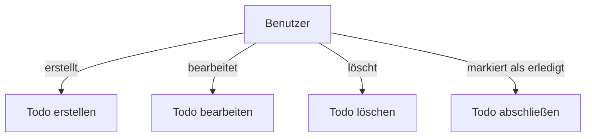

# Anwendungsfalldiagramm und Anforderungen

## A. Anwendungsfalldiagramm (Use Case Diagram)

## B. Akteure

- **Benutzer**: Eine Person, die die Todo-App verwendet, um Aufgaben zu verwalten und zu organisieren.

## C. Nicht-funktionale Anforderungen (FURPS)

### Funktionalität (Functionality)

- Die App muss mindestens 75% der CRUD-Operationen (Create, Read, Update, Delete) für Todos erfolgreich ausführen können.
- Die App muss eine Offline-Funktionalität bieten, die mindestens 24 Stunden ohne Internetverbindung funktioniert.

### Benutzerfreundlichkeit (Usability)

- Die App muss eine durchschnittliche Ladezeit von unter 2 Sekunden aufweisen.
- Die App muss eine Touch-Zielgröße von mindestens 48x48 Pixeln für alle interaktiven Elemente bieten.

### Zuverlässigkeit (Reliability)

- Die App muss eine Verfügbarkeit von 100% gewährleisten.
- Die App muss Datenverlust bei Abstürzen verhindern, indem alle Änderungen mindestens alle 5 Minuten automatisch gespeichert werden.

### Performance (Performance)

- Die App muss mindestens 100 Todos gleichzeitig verwalten können, ohne dass die Applikation crasht.

### Supportability (Supportability)

- Die App muss eine durchschnittliche Fehlerbehebungszeit von unter 24 Stunden für kritische Fehler aufweisen.
