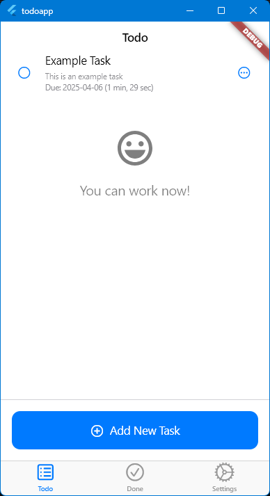
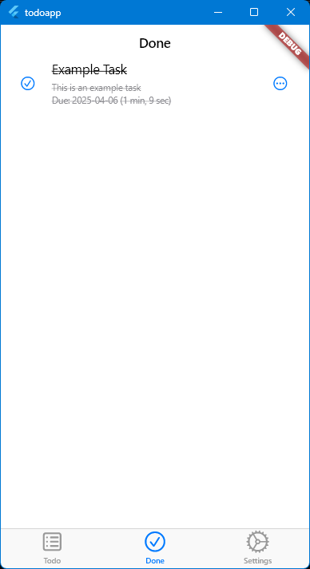
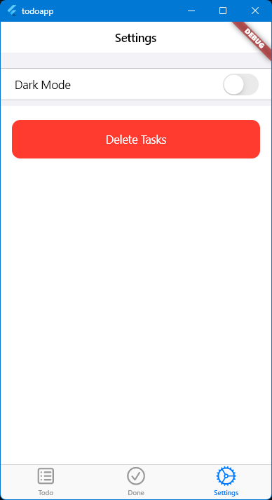

# TodoApp

A clean, elegant Todo application built with Flutter and Cupertino widgets, providing an iOS-style user experience across platforms.

## Features

- Create, edit, and delete tasks
- Mark tasks as completed
- View completed tasks separately
- Set due dates for tasks
- Dark mode support
- Local data persistence using SharedPreferences

## Screenshots




## Getting Started

### Prerequisites

- Flutter SDK (version 3.0.0 or higher)
- Dart SDK (version 3.0.0 or higher)

### Installation

1. Clone the repository:

   ```
   git clone https://github.com/yourusername/todoapp.git
   ```

2. Navigate to the project directory:

   ```
   cd todoapp
   ```

3. Install dependencies:

   ```
   flutter pub get
   ```

4. Run the app:
   ```
   flutter run
   ```

## Project Structure

- `lib/`
  - `main.dart` - Entry point of the application
  - `models/` - Data models
    - `task.dart` - Task model class
  - `providers/` - State management
    - `task_provider.dart` - Manages task state
    - `settings_provider.dart` - Manages app settings
  - `screens/` - App screens
    - `home_screen.dart` - Main tab controller
    - `todo_screen.dart` - Displays active tasks
    - `done_screen.dart` - Displays completed tasks
    - `settings_screen.dart` - App settings
    - `new_task_screen.dart` - Create new tasks
    - `edit_task_screen.dart` - Edit existing tasks
  - `services/` - Business logic
    - `storage_service.dart` - Handles data persistence
  - `widgets/` - Reusable UI components

## Dependencies

- [provider](https://pub.dev/packages/provider) - State management
- [uuid](https://pub.dev/packages/uuid) - Generate unique IDs
- [shared_preferences](https://pub.dev/packages/shared_preferences) - Local storage
- [flutter_svg](https://pub.dev/packages/flutter_svg) - SVG rendering

## Contributing

1. Fork the repository
2. Create a new branch (`git checkout -b feature/amazing-feature`)
3. Commit your changes (`git commit -m 'Add some amazing feature'`)
4. Push to the branch (`git push origin feature/amazing-feature`)
5. Open a Pull Request

## License

This project is licensed under the MIT License - see the LICENSE file for details.

## Acknowledgments

- Flutter team for the amazing framework
- All contributors who participate in this project

## Assumptions
